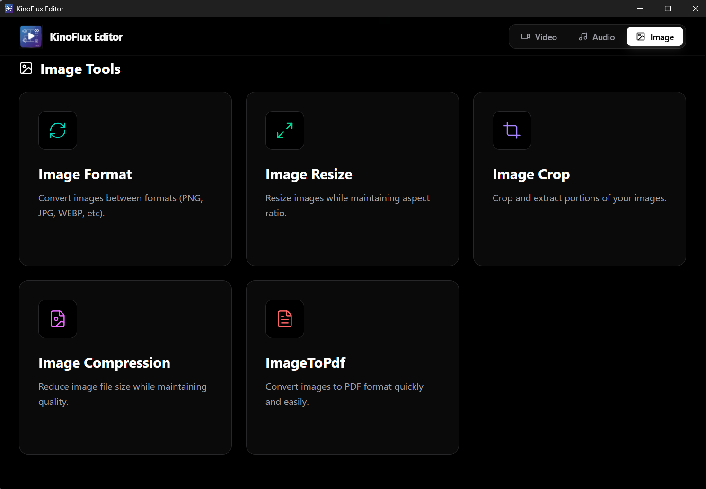
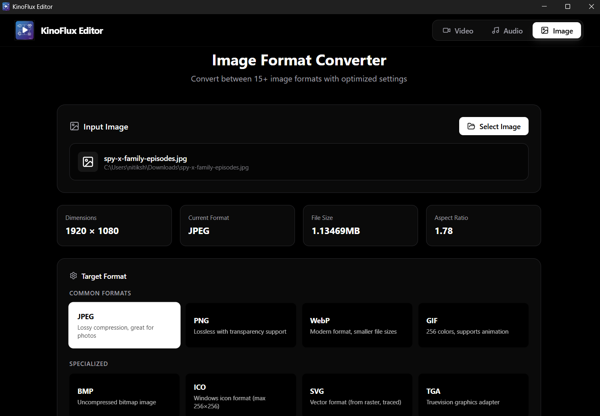
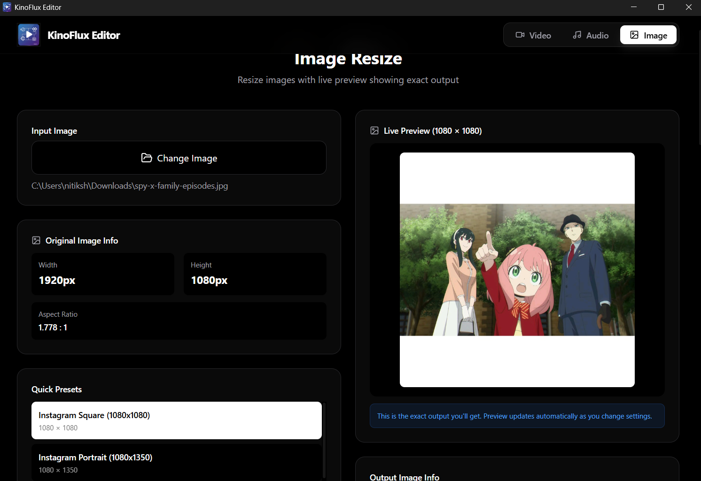
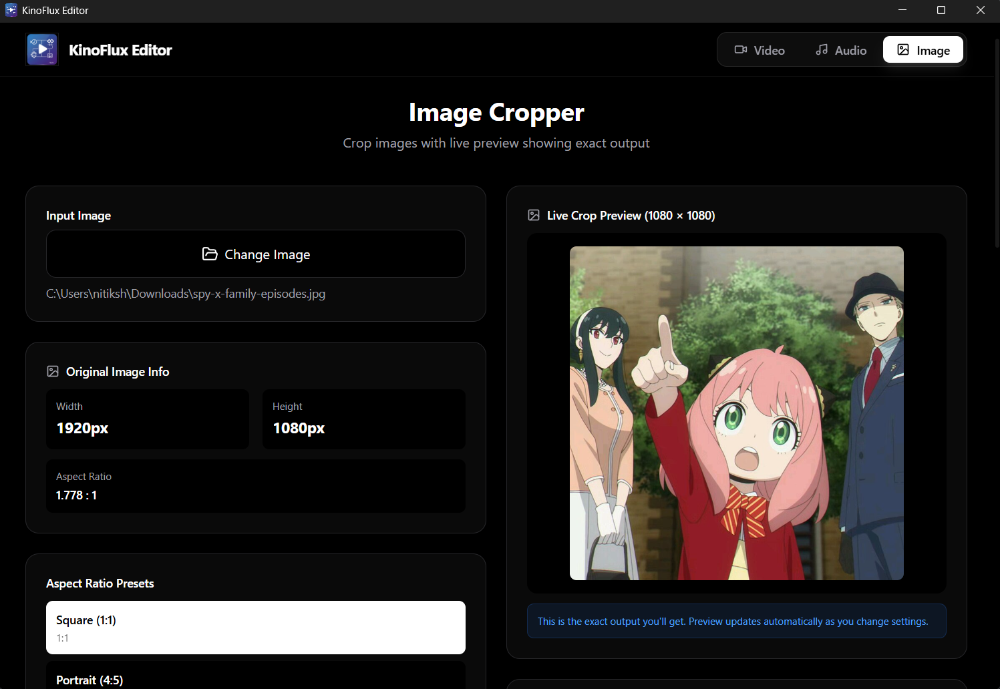
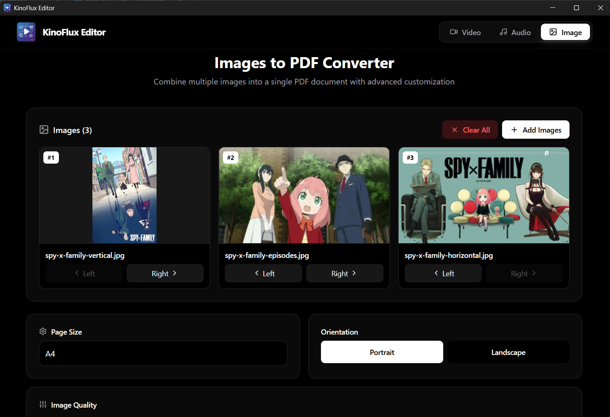
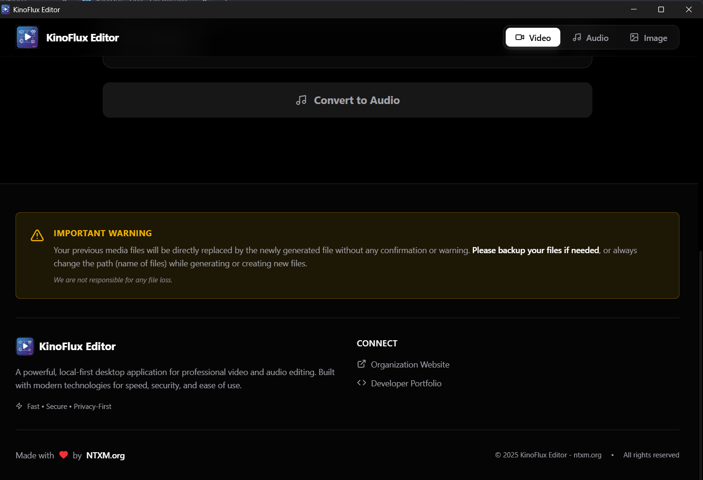

  
  <h1>KinoFlux Editor</h1>
  
<strong>Offline Video, Audio, and Image Tools for Windows</strong>

  

    <a href="#about">About</a> •
    <a href="#features">Features</a> •
    <a href="#screenshots">Screenshots</a> •
    <a href="#installation">Installation</a>
  

---

## About

**KinoFlux Editor** is a lightweight, offline media tool designed for everyday creators who just want things done.

No accounts.  
No cloud uploads.  
No complicated editors.

You install it, open it, pick a tool, and process your files locally on your PC.

---

## Version Overview

- **v0.1.0**
  - Video tools
  - Audio tools

- **v0.1.1 (Current)**
  - Video tools
  - Audio tools
  - **NEW: Image tools**

🔗 Current release:  
https://github.com/ntxmproducts/kinoflux-minimal-video-editor/releases/tag/kinoflux-minimal-video-editor

🔗 Previous release (v0.1.0):  
https://github.com/ntxmproducts/kinoflux-minimal-video-editor/releases/tag/v-0.1.0

---

## Features

### 🎬 Video Tools
- Trim videos
- Merge multiple videos
- Convert video formats
- Change video resolution
- Convert video to audio
- Convert video to HLS (streaming format)

### 🎵 Audio Tools
- Convert audio formats
- Change audio playback speed

### 🖼️ Image Tools (Added in v0.1.1)
- Image format converter
- Image resize
- Image cropping
- Image compression
- Images to PDF converter

All tools work **offline** and process files **locally**.

---

## Screenshots

<em>Main dashboard</em>

<em>Video tools overview</em>

<em>Video trimmer</em>

<em>Video merging</em>

<em>Video resolution converter</em>

<em>Video to audio</em>

<em>Video to HLS converter</em>

<em>Audio tools overview</em>

<em>Audio format converter</em>

<em>Audio speed changer</em>

<em>Image tools overview (new)</em>

<em>Image format converter</em>

<em>Image resize</em>

<em>Image cropping</em>

<em>Image compression</em>

<em>Images to PDF converter</em>

<em>Application footer</em>

---

## Installation

Windows 64-bit only.

1. Download the installer from the releases page  
   https://github.com/ntxmproducts/kinoflux-minimal-video-editor/releases
2. Run the `.msi` file
3. Launch **KinoFlux Editor**
4. Choose a tool and start working

---

## Privacy

Your files never leave your computer.

- No uploads  
- No tracking  
- No internet required  

Everything runs locally.

---

  
Made by <a href="https://ntxm.org">ntxm.org</a>

